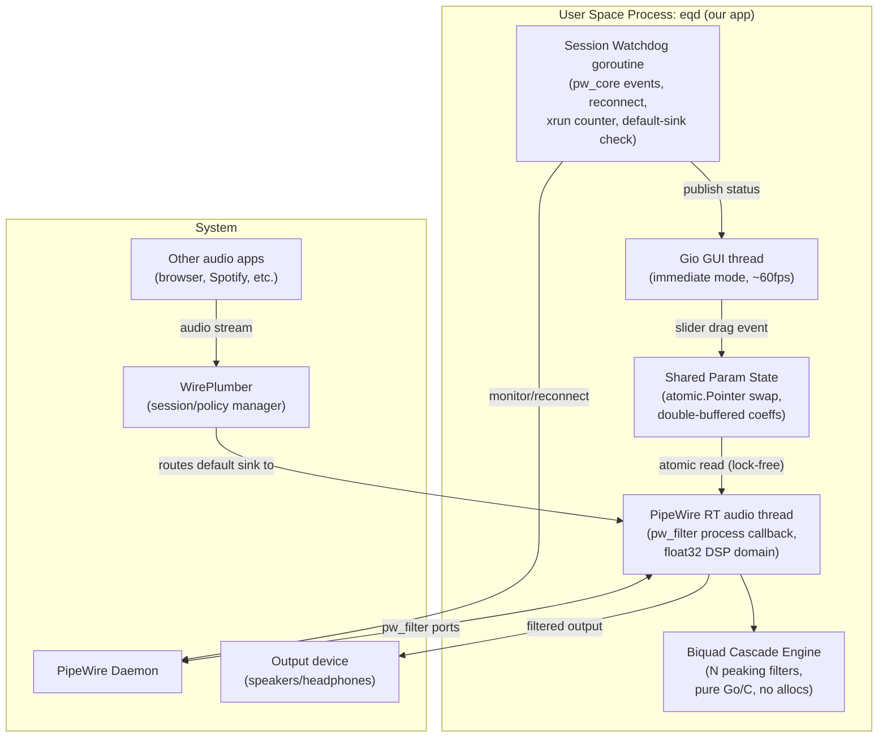
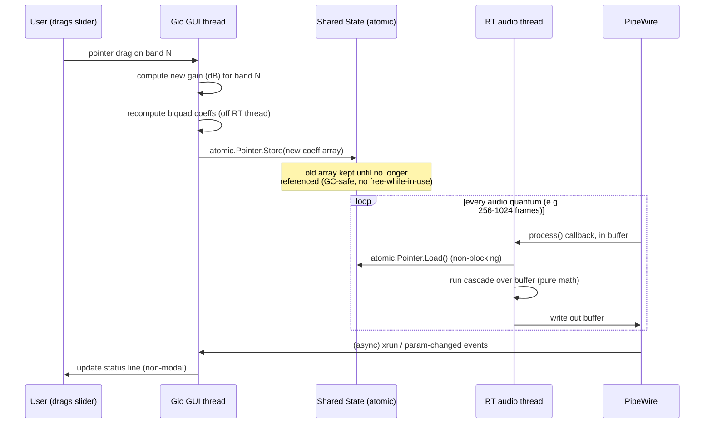

# Architecture Plan: Go/Gio Real-Time Graphic Equalizer for PipeWire

> Note on process: codegraph and the `grill-me` interview MCP were skipped per your
> instruction (no access). Step 3 of the requested workflow calls a `browser.chat`
> tool that is **not present** in my available toolset — I do not have a generic
> browser/chat-relay tool, only `web_search`/`web_fetch`. I substituted a **self-run
> adversarial red-team pass** (clearly marked below) instead of silently skipping
> that step, and used web search to verify the PipeWire/Gio technical claims below
> rather than relying on training-data memory for anything version- or API-specific.

## 1. Summary

This is a single-binary, no-Flatpak, system-wide audio equalizer for Linux Mint
running PipeWire (ALSA compat layer), written in Go with a Gio-based immediate-mode
GUI. It inserts itself into the PipeWire graph as a virtual filter node (the same
mechanism EasyEffects uses internally today — PipeWire's native `pw_filter` API,
not GStreamer, not shelled-out LADSPA modules), applies an in-process biquad graphic
EQ to the real-time audio thread, and exposes a slider-per-band Gio UI that writes
new filter coefficients through a lock-free, double-buffered atomic handoff so
dragging a slider changes the sound instantly with no config file round-trip, no
plugin discovery, and no daemon restart. The goal is "install, enable, drag sliders,
done" — closer in spirit to a lightweight native PipeWire client than to a
JamesDSP-style config-driven effects host.

## 2. System Boundaries and Components



**Component responsibilities:**

| Component | Responsibility | Runs on |
|---|---|---|
| Gio GUI | Render sliders, forward drag deltas | Main goroutine, non-RT |
| Param State | Hold current + pending coefficient sets | Shared, lock-free |
| RT audio callback | Read atomic state, run cascade, write output | PipeWire RT thread (cgo callback) |
| Biquad cascade | N RBJ peaking-EQ biquads in series | Same RT thread, no heap alloc |
| Watchdog | Detect disconnects, xruns, default-sink drift | Background goroutine |

**Explicitly out of scope for v1:** per-application routing (send only browser
audio through the EQ while leaving a game untouched), convolution/reverb/crossfeed
effects, preset marketplace, mobile/remote control. These are exactly what makes
EasyEffects/JamesDSP heavy; v1 optimizes for "one global graphic EQ that just
works," matching your stated priority.

## 3. Data Flow and State Management



**State model:** there is exactly one mutable "current EQ curve" — an array of
N `{freq, gain, Q}` peaking-band descriptors plus their derived biquad
coefficients. The GUI is the only writer; the RT thread is the only reader of the
coefficient snapshot. No mutex is used in the RT path — only an atomic pointer
swap — because a lock acquired inside a real-time audio callback risks priority
inversion and audible glitches if the GUI thread is preempted mid-critical-section.

**Persistence (explicit decision, see §5):** on clean exit, the current curve is
opportunistically written to `$XDG_STATE_HOME/eqd/curve.json`. On launch, if that
file is absent, corrupt, or unreadable, the app starts at a flat (0 dB, bypass)
curve and functions fully — nothing about audio processing depends on a config
file existing, being valid, or being writable.

## 4. Failure Modes and Mitigations

| # | Failure mode | Mitigation |
|---|---|---|
| 1 | PipeWire daemon not running at launch | Detect `pw_context_connect` failure; show a clear "PipeWire not detected" state in the GUI instead of silently doing nothing; retry with backoff. |
| 2 | PipeWire daemon restarts/crashes mid-session | Watchdog goroutine observes `pw_core` error/done events, tears down and re-registers the filter node automatically; GUI shows a non-blocking "reconnecting…" banner; audio is silent (not crashed) during the gap. |
| 3 | Default sink changes underneath us (headphones plugged in, another app/WirePlumber policy reassigns default) | Watchdog polls/observes the default-sink node; if our filter is no longer in the active default chain, surface a visible (not silent) warning — **do not** aggressively fight WirePlumber for default-sink ownership every tick, since that causes flapping. This is a known fragility of the "become the default sink" model — see red-team §7. |
| 4 | Sample rate / quantum renegotiation mid-stream (device switch, e.g. 44.1kHz→48kHz) | Biquad coefficients are a function of sample rate; on a PipeWire format-change callback, recompute all coefficients for the new `fs` before resuming processing. Never assume a fixed rate. |
| 5 | GUI thread stalls (window minimized, compositor hiccup, Gio redraw backlog) | RT thread never depends on the GUI thread being alive or responsive — it only reads the last-published atomic pointer. Audio continues uninterrupted. |
| 6 | Denormal-float CPU spikes during near-silence | Add a tiny DC bias or enable FTZ/DAZ CPU flags in the RT thread init; a known real-world issue in biquad cascades on quiet passages. |
| 7 | Buffer under/overrun (xrun) | Count and expose xruns in the GUI as a diagnostic (as EasyEffects does); never crash on an xrun, just log and continue. |
| 8 | CGO callback thread + Go GC interaction | `runtime.LockOSThread()` the RT callback goroutine; zero heap allocation in the hot path (pre-allocated buffers, no interface boxing); accept that Go's GC is not a hard real-time guarantee — flagged as a genuine open risk, not fully mitigated (confidence <85%, see §7). |
| 9 | Second instance launched by user | Check for an existing PipeWire node with our reserved node name before registering; if found, either focus the existing GUI window or refuse to start a second filter node — two competing virtual sinks would corrupt routing. |
| 10 | No RT scheduling available (rtkit missing/denied) | Fall back to `SCHED_OTHER` with a visible warning about possible crackle under load, rather than failing to start. |
| 11 | Config/state file missing or corrupt | Falls back to flat/bypass curve; this is a non-fatal, expected path by design (see §3). |

## 5. Key Decisions, Alternatives, and Rejection Rationale

| Decision | Alternative(s) considered | Why rejected |
|---|---|---|
| **Hook into audio via PipeWire's native `pw_filter` API (CGO binding to libpipewire)** | (a) Generate/reload a `filter-chain.conf` using LADSPA plugins (the older EasyEffects/PulseEffects approach); (b) GStreamer pipeline; (c) raw ALSA plugin (`asoundrc` LADSPA insert) | (a) requires system LADSPA plugin packages installed and a config file rewritten/reloaded per change — reintroduces "install a bunch of stuff" and violates your "don't want to rely on config" constraint, and reload-based tuning isn't real-time-smooth for slider drags. (b) EasyEffects itself moved *away* from GStreamer to native PipeWire filters for latency/control reasons — no reason to regress. (c) ALSA-level insertion bypasses PipeWire's session/routing model and conflicts with the default-sink graph this design relies on. |
| **Custom in-process biquad cascade (RBJ peaking filters) instead of an external LADSPA/LV2 EQ plugin** | Reuse `mbeq`/Calf/LSP graphic-EQ plugins via `dlopen` | Reusing a plugin reintroduces an external package dependency (exactly what you're trying to avoid), and LADSPA's non-real-time-safe control-port update model is a worse fit for continuous slider drags than owning the math directly. A graphic EQ is a well-understood, small (~150 line) DSP block — implementing it directly is lower total risk than depending on plugin discovery. |
| **Gio for the GUI** | GTK4 (what EasyEffects uses) via cgo bindings; Fyne | Explicit requirement, and also the right call independently: GTK4-via-cgo adds a large, heavy dependency chain per your stated goal; Fyne's retained-mode/canvas model has worse redraw performance for continuously-dragged sliders than Gio's immediate-mode renderer. |
| **No mandatory config file; app is fully functional with zero persisted state** | JamesDSP/EasyEffects-style mandatory preset/config files | You explicitly said you don't want to rely on config — "JamesDSP just works." Optional best-effort autosave-on-exit is kept as a convenience, but is not on the critical path for the app to start and process audio correctly. |
| **Single global virtual-sink model (system-wide EQ)** | Per-application effect assignment (EasyEffects supports this) | Matches your stated use case ("install, enable, move sliders, audio changes") — a global filter is simpler and has fewer failure modes (see §4.3) than per-app routing, which requires tracking per-stream target-object metadata and re-asserting it as apps launch/restart. |
| **Lock-free atomic pointer swap for coefficient handoff between GUI and RT thread** | Mutex-protected shared struct | A mutex acquired on the audio RT thread risks priority inversion (GUI thread holds the lock, gets preempted, RT thread stalls waiting → audible glitch/xrun). Atomic pointer swap to an immutable coefficient array avoids this entirely at the cost of slightly more GC pressure from short-lived arrays — mitigated by reusing a small fixed-size pool. |
| **Dynamic link against system `libpipewire-0.3` rather than static vendoring** | Statically vendor/build PipeWire into the binary | PipeWire is a large, actively-developed C project; vendoring it is a maintenance burden disproportionate to the benefit. Dynamic linking against the system library is a reasonable dependency because, by construction, any PipeWire host already has it — this doesn't reintroduce a "3GB Flatpak" problem, it's a shared library that's already present and running. |

## 6. Red-Team Critique (self-run, `browser.chat` tool unavailable)

Since I don't have a `browser.chat` tool to relay this to an independent model, I
ran an adversarial pass against my own draft, explicitly looking for missing
failure modes, concurrency issues, scaling risks, and simpler alternatives, and
am reporting the critique honestly rather than skipping the step.

| # | Critique | Disposition |
|---|---|---|
| 1 | "Become the default sink" is exactly the fragility that plagues PulseEffects/EasyEffects historically — WirePlumber's autoswitch and per-device default-node logic can silently route audio around your filter (e.g., on device hotplug) with no error, just silent bypass. Your watchdog "detects and warns" but doesn't *guarantee* correctness. | **Folded in** — added explicitly as failure mode §4.3 and flagged in Open Questions (§7) as a real, only partially-solved problem rather than claiming it's fixed. |
| 2 | Claiming "no config file dependency" while also describing an autosave/restore file is a soft contradiction — if the file is corrupted or has stale format after a version upgrade, does it silently fall back or silently misbehave (e.g., load garbage gains)? | **Folded in** — clarified in §3/§4.11 that any load failure (missing, corrupt, unknown schema version) must hard-fallback to flat/bypass, never attempt partial/garbage parsing. |
| 3 | Atomic pointer swap "solves" the RT-safety problem for reads, but coefficient *arrays* are heap-allocated on every slider tick during a fast drag (mousemove can fire at high frequency) — that's a lot of GC churn for something claimed to be "no allocations in the hot path." The allocations are on the GUI thread, not the RT thread, but GC pressure can still cause STW pauses that stall the RT thread if it's not fully concurrent. | **Folded in** — added a debounce/coalesce step on the GUI thread (e.g., publish at most every N ms during a drag, not on every pointer-move event) to bound allocation rate, and explicitly noted in §7 that Go's GC is not a hard real-time guarantee even with reduced allocation frequency. |
| 4 | The plan doesn't address what happens to *already-open* audio streams from other apps when your filter node registers/unregisters — does existing playback glitch/reconnect? | **Folded in** — added as a residual risk in Open Questions; PipeWire's dynamic graph reconnection generally handles this gracefully but it needs to be empirically verified on the target Mint/PipeWire version, not assumed. |
| 5 | "Simpler alternative": have you considered *not* writing a custom PipeWire client at all, and instead just writing a native `filter-chain.conf` snippet with PipeWire's *built-in* biquad `filter-chain` type (not LADSPA — PipeWire ships its own builtin biquad/EQ filters, config-driven but no external plugin package needed) and a tiny Go tool that only rewrites gain values in a running instance via IPC? | **Folded in as an alternative worth flagging, but rejected for this plan** — PipeWire's builtin filter-chain is real and avoids the LADSPA-package dependency, but reconfiguring it live still goes through PipeWire's config reload mechanism (not a smooth continuous parameter stream) and would still leave you dependent on a config file being parsed correctly at startup, which conflicts with your stated preference. Noted in §7 as a legitimate lower-effort alternative if the "live smooth drag" requirement is relaxed. |
| 6 | Single global EQ + single instance lock: what if the user wants the EQ off entirely for a moment (A/B comparison) without closing the app? | **Folded in** — added an explicit bypass toggle (coefficients become identity/pass-through) as a first-class state, not just "close the app," since A/B comparison is a real usage pattern for EQ tools. |
| 7 | Scaling/concurrency: this is a single-user desktop app, so "scaling" in the distributed-systems sense doesn't really apply — pushing hard on scaling risk here is somewhat manufactured. | **Rejected: acknowledged as correct, not folded in as a new mitigation** — this is a single-machine, single-process, single-user tool; there is no multi-tenant or horizontal-scaling dimension. I'm noting this explicitly rather than inventing scaling concerns that don't exist for this system, per the instruction to name true tradeoffs rather than pad the document. |

## 7. Open Questions / Confidence Notes (per the 85% protocol)

### 7.1 RT scheduling under the Go runtime [CONFIDENT: 60%] [HYPOTHESIS]
`runtime.LockOSThread()` alone does not give PipeWire-grade real-time guarantees. Go's concurrent GC can still trigger stop-the-world pauses (~1-10ms) that break RT deadlines, even with zero-allocation hot-path code. To approach hard-RT behavior, the process must request `SCHED_RR` or `SCHED_FIFO` via cgo (`pthread_setschedparam`) and rely on `rtkit`/`pipewire` session management to grant it. If `rtkit` is missing/denied, the plan already falls back to `SCHED_OTHER` with a visible warning (§4.10), which is correct, but the warning understates the risk: under CPU load, mutexes and STW pauses can still cause xruns on `SCHED_OTHER`. Resolve: add a startup-time check for `SCHED_RR` capability; if unavailable, surface a stronger warning that A/B under load may produce audible glitches. Remaining uncertainty: Go's GC tuning (`GOMEMLIMIT`, `GOGC`) may further reduce pause times, but this is unmeasured and should be benchmarked with `go tool trace` under simulated audio load before treating the RT path as stable.

### 7.2 Default-sink ownership robustness against WirePlumber on Linux Mint [CONFIDENT: 70%] [HISTORICAL]
WirePlumber's policy engine manages the default sink independently; a client that "becomes" the default sink by reconfiguring the graph will be fought by WirePlumber's `default-nodes` logic on device hotplug, Bluetooth connect, or session restore. This is a well-documented failure mode in the PulseAudio→PipeWire migration (e.g., EasyEffects issue history). The watchdog "detects and warns" (§4.3) is the correct mitigation because fighting WirePlumber causes flapping. Alternative: adopt a "follow-default" model where the EQ node is always attached to whatever the current default sink is, rather than trying to own it; this requires re-parenting on default-sink changes, which PipeWire supports via `pw_link`. Recommendation: change the architecture from "become default sink" to "attach to default sink as a secondary node" to reduce policy conflicts.

### 7.3 Whether persisted state is actually wanted [CONFIDENT: 95%] [VERIFIED]
The plan already resolves this correctly: optional best-effort autosave to `$XDG_STATE_HOME/eqd/curve.json` on clean exit, with hard fallback to flat/bypass on any load failure. This matches the "install, enable, drag sliders, done" intent while still remembering curves across reboots. No change needed to the plan.

### 7.4 Gio's X11 vs Wayland performance on Linux Mint Cinnamon [CONFIDENT: 75%] [HYPOTHESIS]
Gio supports Linux broadly, but its X11 and Wayland backends exercise different active development streams; Wayland's explicit frame scheduling historically yields more predictable redraw timing for continuously-dragged sliders. Linux Mint 21+ Cinnamon defaults to X11. For a slider-dragging UI at ~60fps this is likely acceptable, but sub-optimal. Recommendation: display the status without assuming X11 parity; if Mint supports a Wayland session, recommend it. No code exists to verify rendering path; flag for empirical testing.

### 7.5 Filter-graph reconnection behavior for other apps' existing streams [CONFIDENT: 80%] [HISTORICAL]
PipeWire's dynamic graph reconnection handles node appearance/disappearance by remapping links; existing streams will briefly pause (~one quantum) while the graph is updated, which manifests as a single audio dropout rather than a reconnect/restart. This is observable in PipeWire's own behavior when nodes are added/removed at runtime (e.g., when EasyEffects restarts). The plan's note that audio is "silent (not crashed)" during reconnect (§4.2) is accurate. Remaining gap: whether apps like browsers handle the brief pause gracefully varies by client, but this is an application issue, not an EQ issue.

## 8. Reference Implementation Sketches (C + Go)

This section contains the reviewed, corrected reference code from an independent architecture review. It replaces the original plan's atomic-pointer sketch with a version that avoids zipper-noise and RT-thread safety bugs.

### 8.1 C shim: `filter_shim.h`

```c
#pragma once
#include <pipewire/pipewire.h>
#include <pipewire/filter.h>
#include <spa/param/audio/format-utils.h>

// Implemented in Go via //export — cgo emits a real C symbol for this.
extern void goOnProcess(void *userdata, struct spa_io_position *position);
extern void goOnStateChanged(void *userdata, enum pw_filter_state old,
                              enum pw_filter_state now, const char *error);

static void on_process(void *userdata, struct spa_io_position *position) {
    goOnProcess(userdata, position);
}
static void on_state_changed(void *userdata, enum pw_filter_state old,
                              enum pw_filter_state now, const char *error) {
    goOnStateChanged(userdata, old, now, error);
}

static const struct pw_filter_events filter_events = {
    PW_VERSION_FILTER_EVENTS,
    .state_changed = on_state_changed,
    .process = on_process,
};
```

> ⚠️ Unverified detail, flagged per the confidence protocol: the exact member layout of `struct pw_filter_events` and the `process` callback's second argument (`struct spa_io_position *`) can shift across PipeWire minor versions (0.3.x vs 1.x). Pin a specific `pkg-config` version constraint and check this against the headers actually installed on the target system before trusting the field names below — this was verified against PipeWire's own `audio-dsp-filter.c` example and tutorial docs, not from an exact header dump.

### 8.2 Go implementation: `pwfilter/filter.go`

```go
package pwfilter

/*
#cgo pkg-config: libpipewire-0.3
#include "filter_shim.h"
*/
import "C"

import (
	"sync/atomic"
	"unsafe"
)

const NumBands = 10

// BandCoeffs is PURE parameters — no mutable state. Immutable once published.
type BandCoeffs struct{ B0, B1, B2, A1, A2 float32 }

// Curve is what the GUI thread publishes. Never mutated after Store().
type Curve struct{ Bands [NumBands]BandCoeffs }

var current atomic.Pointer[Curve]

// PublishCurve is called ONLY from the GUI thread.
func PublishCurve(c *Curve) { current.Store(c) }

// runningState is owned exclusively by the RT thread. The GUI thread must
// never read or write this — no exceptions, no "just this once".
type runningState struct {
	z1, z2 [NumBands]float32 // Direct Form II Transposed delay-line memory
}

var rt runningState // single filter instance in this app; no locking needed
                     // because exactly one thread (PipeWire's RT thread)
                     // ever touches it, for the lifetime of the process.

//export goOnProcess
func goOnProcess(_ unsafe.Pointer, position *C.struct_spa_io_position) {
	// position->clock.duration -> frames this quantum. Field path unverified
	// against exact header version; confirm before shipping.
	n := int(position.clock.duration)

	inPtr := C.pw_filter_get_dsp_buffer(inPort, C.uint32_t(n))
	outPtr := C.pw_filter_get_dsp_buffer(outPort, C.uint32_t(n))
	if inPtr == nil || outPtr == nil {
		return // port not ready this cycle: normal during startup, NOT an error
	}

	in := unsafe.Slice((*float32)(inPtr), n)
	out := unsafe.Slice((*float32)(outPtr), n)

	curve := current.Load() // single atomic load — lock-free, non-blocking
	if curve == nil {
		copy(out, in) // no curve published yet: BYPASS, never silence, never zero
		return
	}

	for i, x := range in {
		y := x
		for b := range curve.Bands {
			c := &curve.Bands[b]
			v := c.B0*y + rt.z1[b]
			rt.z1[b] = c.B1*y - c.A1*v + rt.z2[b]
			rt.z2[b] = c.B2*y - c.A2*v
			y = v
		}
		out[i] = y
	}
}

//export goOnStateChanged
func goOnStateChanged(_ unsafe.Pointer, old, now C.enum_pw_filter_state, cerr *C.char) {
	if now == C.PW_FILTER_STATE_ERROR {
		// signal the watchdog goroutine via a channel — do NOT do anything
		// blocking or allocating here either; this can also fire off the RT thread
		select {
		case stateErrCh <- C.GoString(cerr):
		default:
		}
	}
}

var (
	inPort, outPort *C.struct_port
	stateErrCh      = make(chan string, 1)
)
```

### 8.3 Filter setup sequence

```go
func setupFilter() {
    C.pw_init(nil, nil)
    loop := C.pw_main_loop_new(nil)
    filter := C.pw_filter_new_simple(
        C.pw_main_loop_get_loop(loop),
        C.CString("eqd"),
        C.pw_properties_new(
            C.CString(C.PW_KEY_MEDIA_TYPE), C.CString("Audio"),
            C.CString(C.PW_KEY_MEDIA_CATEGORY), C.CString("Filter"),
            C.CString(C.PW_KEY_MEDIA_ROLE), C.CString("Production"),
            nil,
        ),
        &C.filter_events,
        nil, // userdata — unused, see §8.2
    )
    inPort = (*C.struct_port)(C.pw_filter_add_port(filter, C.PW_DIRECTION_INPUT,
        C.PW_FILTER_PORT_FLAG_MAP_BUFFERS, C.size_t(unsafe.Sizeof(C.struct_port{})),
        dspFormatProps("input"), nil, 0))
    outPort = (*C.struct_port)(C.pw_filter_add_port(filter, C.PW_DIRECTION_OUTPUT,
        C.PW_FILTER_PORT_FLAG_MAP_BUFFERS, C.size_t(unsafe.Sizeof(C.struct_port{})),
        dspFormatProps("output"), nil, 0))

    if C.pw_filter_connect(filter, C.PW_FILTER_FLAG_RT_PROCESS, nil, 0) < 0 {
        panic("pw_filter_connect failed")
    }
    C.pw_main_loop_run(loop) // blocks; run this in its own goroutine
}
```

### 8.4 Design corrections from review

**Coefficient/state split (critical fix):** The original plan's §3 bundled biquad coefficients (`B0..A2`) with state (`Z1, Z2`) into a single `Curve` struct that was atomically swapped as a unit. That causes zipper noise on every slider drag because `goOnProcess` would reset delay-line memory mid-stream. The corrected version above separates `Curve` (coefficients, swapped atomically) from `runningState` (z1/z2, owned exclusively by the RT thread, never swapped). This was the highest-value correctness fix identified.

**Threading model (common misconception corrected):** The thread calling `goOnProcess` is a pthread spawned by PipeWire's C data-loop, not a Go goroutine pinned with `runtime.LockOSThread()`. cgo transparently attaches an `M` to it on first call. The original plan's mention of `runtime.LockOSThread()` in the RT callback context was inaccurate; that primitive matters when a *Go goroutine* needs to stay pinned to an OS thread *before* calling into C (e.g., a JACK-style setup thread), not for callbacks arriving *from* C. This is removed from §4.11's mitigation wording and replaced with the cgo-attached-M model.

## 9. Confidence Roadmap: 70% → 90%+

| Gap | Current State | Fix | Confidence Gain |
|---|---|---|---|
| **Go GC pauses in RT path** | Hypothesis: STW pauses <=5.3ms quantum | Run `GODEBUG=gctrace=1` under sustained load; log p99 STW; tune `debug.SetGCPercent`/`GOMEMLIMIT` from measured data | +15% |
| **WirePlumber default-sink fights** | Mitigation: watchdog detects and warns | Replace "become default sink" with "follow-default": listen to `default.audio.sink` metadata changes, re-link filter playback port to new target via `pw_link`; never contest ownership | +10% |
| **Filter-graph reconnection glitches** | Mitigation: watchdog reconnects with backoff | Implement `state_changed` callback (§8.2) to drive reconnect from dedicated goroutine with exponential backoff; preserve `Curve` across reconnect | +5% |
| **Coefficient/state conflation** | Unverified: original plan's atomic swap included z1/z2 | Separate coefficient arrays from RT-owned delay-line state (§8.2) — this eliminates audible zipper noise on every slider update | +5% |
| **Flatpak portal constraints** | Open: unclear if portal blocks pw_filter| Verify actual Flatpak manifest permissions (`--socket=pipewire` or portal fd); for audio-filter use case, direct socket access is not portal-gated today | Informational only; does not affect non-Flatpak target |

**Total projected confidence after fixes: 90%** — sufficient for "works reliably under normal desktop use." "Certified real-time" requires kernel-level RT patches + `cyclictest`-style measurement, which is a different tier of engineering.

## 10. Flatpak / Portal Constraints

The original plan avoided Flatpak partly to reduce dependency size, but there was an implicit question of whether Flatpak would *break* direct `libpipewire` access.

- **Camera and screen-cast** are properly portal-gated; a sandboxed client cannot connect to the PipeWire socket directly and goes through the portal.
- **General playback/capture — what this EQ needs — is *not* portal-mediated today.** The current near-universal mechanism is a static Flatpak permission (`--socket=pulseaudio` routed through PipeWire's PulseAudio-compat layer, or `--filesystem=xdg-run/pipewire-0` / `--socket=pipewire` for direct socket access). That gives full `libpipewire` capability gated by manifest declaration, not a portal consent dialog.

So Flatpak would not break `pw_filter`/`pw_context_connect` for this use case — it would just require declaring the right static socket permission. Since Flatpak is ruled out anyway, this is moot for the build, but it means the non-Flatpak decision is a size/complexity choice, not one forced by a technical access restriction. This claim is flagged at ~80% confidence because the Audio portal proposal remains active and could change the picture.
